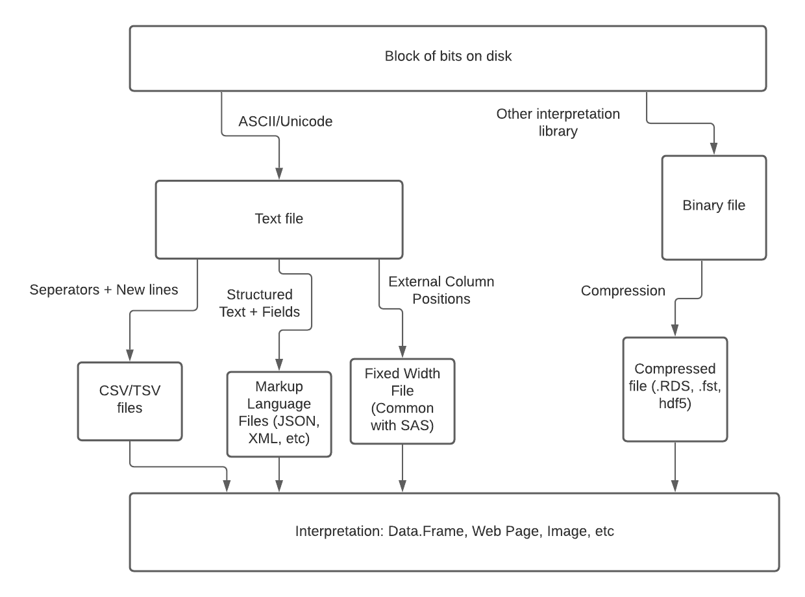

Large Data in R: Or How I Learned to Stop Worrying and Allocate That
Vector
================
Ben Sabath

Updated April 09, 2021

------------------------------------------------------------------------

## Table of Contents

-   [Part 0: Environment Set Up](#part-0-environment-set-up)
-   [Part 1: What is Large Data?](#part-1-what-is-large-data)
-   [Part 2: How Does R Work With
    Memory?](#part-2-how-does-r-work-with-memory)
-   [Part 3: Thinking about Memory Challenges in
    R](#part-3-thinking-about-memory-challenges-in-r)
-   [Part 4: Working With Data that “Mostly
    Fits”](#part-4-working-with-data-that-mostly-fits)
-   [Part 5: Working With Data That “Doesn’t
    Fit”](#part-5-working-with-data-that-doesnt-fit)
-   [Additional Resources](#additional-resources)

------------------------------------------------------------------------

## Part 0: Environment Set Up

**PLEASE DO THIS BEFORE THE WORKSHOP**

There are multiple ways to set up your environment for this course. Our
focus will be more on the concepts underlying Large Data in R and how to
work through problems, rather then executing specific blocks of code.
However if you’d like to follow along and ensure that you have all
packages you need installed, I’ve provided a `conda` environment in this
repo for your use.

Note: This course assumes that you are comfortable using the command
line and are working on a Unix based system (MacOS or Linux). The
assistance I’ll be able to provide for attendees with windows computers
will be limited.

#### STEP 0 - Clone This Repo

If you’re reading this, you’ve found the git repository with materials
for this course. The easiest way to download all of the materials and
have them properly arranged is to clone this repo. To do this run the
following command

    git clone git@github.com:mbsabath/large_data_in_R

This will create a local copy of this repo on your computer. `cd` to
that directory for the rest of this setup.

#### STEP 1 - Install Conda

If you’re working on a computer that doesn’t currently have conda
installed, you can install miniconda [using this
link](https://docs.conda.io/en/latest/miniconda.html). I recommend the
Python 3.9 version.

#### STEP 2 - Create The Environment

Included in the repo is the file `large_data_env.yml`. This file lists
the packages needed for this course. Conda is great for environment
management and environment sharing since it handles installing all of
the dependencies needed, and can support set up on multiple operating
systems. Creating conda environments for your projects is a separate
subject, but is a great way to make your research projects easy for
others to use and to support reproducibility. To install this
environment run:

    conda env create -f large_data_env.yml

You will be prompted to download and install a number of packages,
please install things as prompted.

If everything worked, you should see an environment named
`large_data_in_R` listed when you run

    conda env list

#### STEP 3 - Run R and Install One Additional Package

To activate the environment, run the following command:

    source activate large_data_in_R

If this is successful, your terminal prompt will change to look
something like this:

    (large_data_in_R) <username> large_data_in_R %

To run Rstudio using the environment, it’s important to run it from the
terminal. To start Rstudio from the terminal, enter

    rstudio

from the terminal where you’ve activated the environment. The rstudio
window that opens will have all required packages already installed,
with the exception of the `chunked` package, which is not available
through conda. To install that package, please run:

``` r
install.packages("chunked")
```

Once `chunked` is installed, your environment is good to go!

## Part 1: What Is Large Data?

### 1.1: Defining Big Data

There is often discussion in data science circles about “what counts” as
big data. For some, it’s data that can’t fit in memory, for others it’s
data so big, it can’t fit on a single hard drive. It might be one single
large file, or TBs upon TBs of small files. It might just be an excel
file large enough that Excel complains when you use it.

 *There’s always
bigger data - Qui Gon Jinn*

For me, I find the most useful definition to be “Data that is big enough
that you cannot use standard workflows”. Any time data is big enough
that you need to adjust your processes to account for that, you’re
entering the world of “Big Data”.

That said, for R users, and generally most academic users, the main big
data issue is data that is too big to be easily worked with in memory.
That is the problem this workshop will seek to address.

### 1.2 What is Data?

#### 1.2.1 Data on Disk

When thinking about and working with data, it’s important to understand
the layers of abstraction present and how they interact with each other.
Think of an html file. On disk, the file is just a structured section of
bits. However, depending on how its encoded (either ASCII or UTF-8), we
have instructions for how to interpret those bits as a text file. An
html file in text format is more readable than the raw bits and can be
edited by a knowledgeable web developer; however, it is not until the
final layer of abstraction, when the information contained in the page
is rendered by your browser that the information in the file can be
easily interpreted.

 *Examples of
layers of abstraction in data*

The same process occurs with any data we want to analyze. Whatever its
ultimate structure or purpose is, all data is blocks of bits, with
abstraction layers that define how those bits should be interpreted.

CSVs, TSVs, and Fixed width files are all text based formats that are
typically used to define data frame like data. They are useful as they
are both human and machine readable, but text is a relatively
inefficient way to store data.

There are also a number of binary formats (which often also have some
compression applied on disk), such as `.fst` files, `hdf5` files, or R
specific `.RDS` files. These have the advantage of being more space
efficient on disk and faster to read, but this comes at the cost of
human readability.

#### 1.2.2 Data in Memory

*Note: this section is an over simplification*

This will be discussed more in part 2, but when working with large data
it’s important to have a sense of what computer memory is. We can think
of computer memory as a long tape. When data is loaded in to memory and
assigned to a variable, such as when you run a line like

``` r
x <- 1:100
```

the operating system finds a section of memory large enough to contain
that object (in this case 100 integers), reserves it, and then connects
its location in memory to the variable. Some objects need to all be on a
contiguous section of the tape, some objects can be spread across
multiple parts of it. Regardless, the program needs to know interpret
the bits stored in memory as a given object. How much space objects take
up depends on the system, but the classic base objects in C are as
follows:

-   integer: 32 or 64 bits, depending on architecture
-   double: floating point, typically 64 bits
-   char: typically 8 bits
-   boolean: In theory could be 1 bit, in practice varies by language
    and processor

One common type not seen here is the string. strings are arrays of
characters stored in memory. The characters need to be in a contiguous
section of memory, otherwise the system will not be able to interpret
them as a single string.

### 1.3 Flow of Data in a Program

 In a
typical program, we start with data on disk, in some format. We read it
in to memory, do some stuff to it on the CPU, store the results of that
stuff back in memory, then write those results back to disk so they can
be available for the future.

There are limits on this. A single CPU can only do one calculation at a
time, so if we have a lot of calculations to do, things may take a
while. Similarly, memory can only hold so much data, and if we go over
that limit, we either get an error, or have to find some work around.
Understanding this flow is key to analyzing how to find those
workarounds, and what the limits on our workarounds are.

## Part 2: How Does R Work With Memory?

Basically everything in this section is pulled from Chapters 2 and 3 of
[Hadley Wickham’s Advanced
R](https://adv-r.hadley.nz/names-values.html). I can’t recommend that
enough as a resource to really understand what’s going on in R under the
covers.

### 2.1 R as a Language

Why do people use R? There are a number of other statistical programming
languages out there.

``` r
library(lobstr)
```

### 2.2 Variable Assignment and Copy behavior

### 2.3 Data types and variable size

### 2.4

## Part 3: Thinking about Memory Challenges in R

### 3.1 Trade Offs When Working With Big Data

If you’re working with data large enough to hit the dreaded
`cannot allocate vector` error when running your code, you’ve got a
problem. When using your naive workflow, you’re trying to fit too large
an object through the limit of your system’s memory.

 *An
example of a large object causing a bottleneck*

When you hit a memory bottleneck (assuming it’s not caused by a simple
to fix bug in your code), there is no magic quick solution to getting
around the issue. There’s a number of resources that need to be
considered when developing any solution:

-   Development Time
-   Program Run Time
-   Computational Resources
    -   Number of Nodes
    -   Size of Nodes

A simple solution to a large data problem is just to throw more memory
at it. Depending on the problem, how often something needs to be run,
how long it’s expected to take, etc, that’s often a decent solution, and
minimizes the development time needed. However, compute time could still
be extended, and the resources required to run the program are quite
expensive. For reference, a single node with 8 cores and 100GB of memory
costs 300$/month on Amazon. If you need 400GB of memory (which some
naive approaches using the CMS data I’m familiar with do), the cost for
a single node goes up to 1200 per month.

Conversely, since all computing processes can be theoretically
parallelized (although just because something is parallelized, it
doesn’t mean it will perform better), with enough development time, any
algorithm could be made to run in a standard personal computer’s memory.

The appropriate solution depends on the needs and constraints of the
specific project.

### 3.2 Types of Memory Challenges

For the remainder of this workshop, we’re going to cover two types of
memory problems. The separation between these is fairly arbitrary, and
in most cases you’ll want to use techniques from both sets of approaches
to resolve your big data problems.

The two types are as follows: - Data that “mostly fits” in memory. This
is data where you can read the entire object in to memory, and even run
some basic calculations on the set. However complicated calculations or
data cleaning operations lead to you running out of memory. - Data that
doesn’t fit in memory. This is data where you can’t even load what you
need in to memory

## Part 4: Working With Data that “Mostly Fits”

When working with data that “mostly fits”, our main goals our to reduce
the memory impact of all the computational processes being done. There
are a number of approaches to this, which include both explicit use of
tools and techniques designed to reduce the memory impact of operations,
and techniques for thinking about program flow to minimize what needs to
be held in memory at any point in time.

#### 4.1 In Place Changes

As previously discussed, R has unpredictable behavior with regard to
data duplication. If a vector has been referred to at least twice at any
point in the code, any change to that vector will lead to duplication of
the entire vector. When we’re dealing with data approaching the size of
memory, any duplication poses the risk of creating an error and halting
our program.

Working with In Place changes is the best way to avoid this duplication.
R List objects don’t require contiguous blocks of memory and allow for
in place changes. However, many of the default functions in R do not
support vectorized operations on list objects. Additionally, since the
standard Data Frame object in R is a list of vectors, we are unable to
do in place data manipulation with the tools in base R.

It is worth mentioning that pandas data tables in python, the standard
method for python data analysis have default support for in place
operations. While R is the standard tool in many academic disciplines,
Python is a strong alternative approach for many applications.

### 4.2 Inplace Data Frame Manipulation with `data.table`

One of the best tools out there for working with large data frames in R
is the `data.table` package. It implements the `data.table` object, with
many routines written and compiled in C++ and designed for parallel
processing. It also supports in place mutation operations on
data.frames, as well as having a nice syntax for data aggregation and
data joining.

To demonstrate this, lets create two reasonably sized random data
frames, one using a standard R data frame, and one using `data.table`.

``` r
set.seed(111917)
library(data.table)

df <- data.frame(x = rnorm(1e6), y = rnorm(1e6), z = rep_len(c("a", "b"), 1e6))
dt <- data.table(x = rnorm(1e6), y = rnorm(1e6), z = rep_len(c("a", "b"), 1e6))
```

Show data duplication within df

``` r
tracemem(df)
```

    ## [1] "<0x7f8c3d472f18>"

``` r
df$x <- df$x + 1
```

    ## tracemem[0x7f8c3d472f18 -> 0x7f8c3ecd02c8]: eval eval withVisible withCallingHandlers handle timing_fn evaluate_call <Anonymous> evaluate in_dir block_exec call_block process_group.block process_group withCallingHandlers process_file <Anonymous> <Anonymous> 
    ## tracemem[0x7f8c3ecd02c8 -> 0x7f8c3ecd0318]: $<-.data.frame $<- eval eval withVisible withCallingHandlers handle timing_fn evaluate_call <Anonymous> evaluate in_dir block_exec call_block process_group.block process_group withCallingHandlers process_file <Anonymous> <Anonymous> 
    ## tracemem[0x7f8c3ecd0318 -> 0x7f8c3ecd0688]: $<-.data.frame $<- eval eval withVisible withCallingHandlers handle timing_fn evaluate_call <Anonymous> evaluate in_dir block_exec call_block process_group.block process_group withCallingHandlers process_file <Anonymous> <Anonymous>

``` r
untracemem(df)
```

No duplication with `data.table`

``` r
tracemem(dt)
```

    ## [1] "<0x7f8c3d465800>"

``` r
dt[, x := x+1]
untracemem(dt)
```

In place memory work also improves computational speed and efficiency.
There are a number of reasons that `data.table` is faster than the
standard R implementation, but a large part of that is that R no longer
needs to wait for the system to allocate additional memory for each of
these calculations.

In general, R duplication is somewhat unpredictable, as it depends on
the number of times an object has been referenced at any point during a
session. `tracemem` is a necessity for identifying duplication events.
However for complex calculations that can’t be implemented using
`data.table` or other packages specifically built for in place
calculations, you may need to implement your algorithm using `rcpp` or
with the R API in C.

### 4.3 Avoid Keeping Uneeded Data in Memory

Frequently, data cleaning operations contain mutation, filtering, and
aggregation steps. When there is no risk of filling memory, the order
these steps are performed doesn’t matter. However, when memory usage
needs to be taken in to consideration, we no longer have the same
flexibility in our approaches.

Let’s imagine we have a nationwide panel data set of individuals where
we hav one observation per person per year, where we know each person’s
age, gender, and state of residence.

We want to calculate the number of men and women in three different age
groups (18-34, 35-64, 65+) for just the population in CA and CT.

What do we need to calculate to do this? We need to:

-   Tag individuals with an indicator for their age group
-   Create counts for each state of individuals by gender and age group
-   Restrict the data to only include individuals in CA and CT
-   Restrict the data to only include individuals older than 18

We can categorize each of these processes as either adding information
or reducing information in the data set.

Let’s constuct the data set:

``` r
set.seed(111917)
people <- data.table(state = sample(c("WA","MA","NY", "CA", "CT"), 1e6, replace = T),
                     age = sample(100L, 1e6, replace = T),
                     gender = sample(c("M","F","NB"), 1e6, replace = T))
summary(people)
```

    ##     state                age            gender         
    ##  Length:1000000     Min.   :  1.00   Length:1000000    
    ##  Class :character   1st Qu.: 25.00   Class :character  
    ##  Mode  :character   Median : 50.00   Mode  :character  
    ##                     Mean   : 50.48                     
    ##                     3rd Qu.: 75.00                     
    ##                     Max.   :100.00

We want to minimize the complexity and size of any calculations that
need to be done with this data. Therefore we want to do all steps that
reduce the size of the data prior to adding any information to the data
set.

``` r
tracemem(people)
```

    ## [1] "<0x7f8c3ef7fc00>"

``` r
cut_set <- people[state %in% c("CA", "CT")]
untracemem(people)

tracemem(cut_set)
```

    ## [1] "<0x7f8c3d997000>"

``` r
cut_set <- cut_set[age >= 18]
tracemem(cut_set)
```

    ## [1] "<0x7f8c4a1eb400>"

``` r
nrow(cut_set)
```

    ## [1] 332038

``` r
untracemem(cut_set)
```

After these two steps, we’ve reduced the data set from 1 million
observations to just 68k. Now all future calculatoins will be performed
on a set less than 10% the size of the original data.

A couple things to note. We didn’t perform the aggregation step (despite
the fact that that would reduce the data size even more), as that step
is dependent on assigning age groups to each individual. Often times
some restricting steps are dependent on other steps that add
information. Data processing is a series of reducing things as much as
possible, adding needed information, than reducing things again.

Also note that while there was no duplication reported by tracemem, the
memory address of the objects in changed after each assignment step.
Even when using data.table, we still need to allocate new memory when we
filter data like this. Therefore, it’s important to know the
distribution of values and to perform the largest restrictions first.
Since we do know our distributions here, we restricted by state first
(60% reduction), and then by age (18% reduction).

Finishing out the process, we assign age groups, and then do our final
aggregation:

``` r
tracemem(cut_set)
```

    ## [1] "<0x7f8c4a1eb400>"

``` r
cut_set[age >= 18 & age < 35, age_grp:= "18-34"]
cut_set[age >= 35 & age < 65, age_grp := "35-64"]
cut_set[age >= 65, age_grp := "65+"]
agg_data <- cut_set[, .(count = .N), by = c("state", "age_grp", "gender")]
agg_data
```

    ##     state age_grp gender count
    ##  1:    CT   18-34      F 11282
    ##  2:    CA     65+      M 23783
    ##  3:    CT     65+      F 24105
    ##  4:    CT   35-64      F 19859
    ##  5:    CA   18-34      M 11345
    ##  6:    CT   35-64     NB 20082
    ##  7:    CT   18-34      M 11356
    ##  8:    CA   18-34      F 11320
    ##  9:    CT     65+     NB 24242
    ## 10:    CT     65+      M 24134
    ## 11:    CA   18-34     NB 11381
    ## 12:    CA   35-64      M 20027
    ## 13:    CA     65+      F 23894
    ## 14:    CT   35-64      M 19955
    ## 15:    CA     65+     NB 23803
    ## 16:    CA   35-64      F 20292
    ## 17:    CT   18-34     NB 11386
    ## 18:    CA   35-64     NB 19792

### 4.4 Manage Data Types

As previously mentioned, R vectors contain many atomic values, each of
which is ultimately one of the base data types in R. These atomic data
types have varying sizes. While the size of these atomic objects differs
only on the level of bytes, when multiplied millions or billions of
times, these small differences add up.

Let’s start by comparing `interger` and `float` vectors:

``` r
int_vec <- rep_len(2L, 1e6)
float_vec <- rep_len(2, 1e6)
object.size(int_vec)
```

    ## 4000048 bytes

``` r
object.size(float_vec)
```

    ## 8000048 bytes

Here we see that the integer vector, specified by using the `L`
following the number is half the size of the float vector, which was
created with syntax more like standard R.

However, memory usage based on data type is not always predictable. We
can see this when looking at boolean variables. Theoretically, a boolean
should be representable with a single bit, and maybe two bits if we need
to account for `NA` values. Let’s see what actually happens:

``` r
int_vec <- rep_len(c(0L, 1L), 1e6)
bool_vec <- rep_len(c(T, F), 1e6)
object.size(int_vec)
```

    ## 4000048 bytes

``` r
object.size(bool_vec)
```

    ## 4000048 bytes

Boolean vectors and integer vectors are the exact same size. This is
because R stores boolean vectors as 32 bits, even though most bits
aren’t needed logically.

String vectors are also an interesting case. Keeping in mind that each
character in a string is one byte, we’d expect a vector of repeated long
strings to be significantly larger than an equivalent integer vector:

``` r
int_vec <- 1:1e6
str_vec <- rep_len(c("Really long string number one",
                     "Second long string, that is even longer than the first"),
                   1e6)
int_str_vec <- as.character(int_vec)
object.size(int_vec)
```

    ## 4000048 bytes

``` r
object.size(str_vec)
```

    ## 8000240 bytes

``` r
object.size(int_str_vec)
```

    ## 64000048 bytes

The reason for this difference is that in order to optimize memory
usage, R sets up a “string pool”. where it stores all unique strings.
Vectors of strings are then just pointers to objects in that shared
string pool. This is why the string representation of all numbers
1-1,000,000 is much larger than a vector of repeated long strings. This
also reduces the need for contiguous memory when dealing with strings,
as we only need contiguous memory for the pointers, and not for the
strings themselves.

### 4.5 Explicit Memory Management

#### 4.5.1 `rm()`

A general principle of optmizing your code for memory is that you should
only keep the things you need. If you created a large vector that you’re
now done with, you can remove the reference by using the `rm()`
function. Note that this won’t free the memory immediately, R will
simply no longer be able to find the data in question. The memory will
ultimately be freed when the garbage collector is run, which brings up
the question of

#### 4.5.2 `gc()`

To quote from Hadley Wikham’s advanced R:

> R uses a tracing GC. This means it traces every object that’s
> reachable from the global18 environment, and all objects that are, in
> turn, reachable from those objects (i.e. the references in lists and
> environments are searched recursively). The garbage collector does not
> use the modify-in-place reference count described above. While these
> two ideas are closely related, the internal data structures are
> optimised for different use cases.
>
> The garbage collector (GC) runs automatically whenever R needs more
> memory to create a new object. Looking from the outside, it’s
> basically impossible to predict when the GC will run. In fact, you
> shouldn’t even try. If you want to find out when the GC runs, call
> `gcinfo(TRUE)` and GC will print a message to the console every time
> it runs.
>
> You can force garbage collection by calling `gc()`. But despite what
> you might have read elsewhere, there’s never any need to call `gc()`
> yourself. The only reasons you might want to call `gc()` is to ask R
> to return memory to your operating system so other programs can use
> it, or for the side-effect that tells you how much memory is currently
> being used.

Key take aways from this:

-   Calling `rm()` removes a reference to an object. When there are no
    global references to an object, it is eligible for deletion during
    garbage collection.
-   Garbage collection is a background process, called by R when more
    memory is needed.
-   Theoretically, you never need to call `gc()`. That said, sometimes
    calling `gc()` appears to make more memory avaiable. It’s possible
    that this reduces some memory sharding issues, but it could also
    just be the higher mysteries of R.

## Part 5: Working With Data That “Doesn’t Fit”

The techniques we have covered so far can help minimize memory usage
when we have a data set in memory, but what happens when the data we
need to analyze is larger than the memory we have access to?

Lets return to the diagram of data flow:

 Looking at this,
we see that memory is basically a holding space in between disk and the
CPU. We use it because I/O operations are super slow (in computing
terms), but there’s nothing that says we need to hold our entire data
set at memory at any particular point. If our data set doesn’t fit in
memory, we can find ways to calculate partial products from portions of
the data set, and then combine these smaller results to get what we
need.

### 5.1 Partial Products

Imagine we have a very tiny comupter, that can only hold 16 numbers at a
time in memory. How could we calculate the average of a vector of \~1
million numbers?

What do we need to know to calculate this?

-   Running sum
-   Number of observations
-   current position in file

``` r
big_data <- sample(4572532, sample(1e6:1000100, 1), replace = T)

buffer_size <- 8
running_sum <- 0
num_obs <- 0
current_pos <- 1

while(TRUE) {
  buffer <- big_data[current_pos:(current_pos + buffer_size - 1)]
  buffer <- buffer[!is.na(buffer)]
  
  # update counts
  for (val in buffer) {
    running_sum <- running_sum + val
    num_obs <- num_obs + 1
  }
  
  # update position
  current_pos <- current_pos + buffer_size
  
  # check if we're at the end
  if (length(buffer) < buffer_size) {
    break
  }
}

cat(paste0("Our Mean: ", running_sum/num_obs, "\n"))
```

    ## Our Mean: 2287653.39501427

``` r
cat(paste0("Built In Mean: ", mean(big_data), "\n"))
```

    ## Built In Mean: 2287653.39501427

If you try to run this on your own, you’ll notice that this partial
product is much slower than the default mean calculation. R’s built in
functions are highly optomized for vectorized data, and for loops in R
are notoriously slow. However, if the source data was not a vector, but
rather a file on disk, running something slowly is better than not being
able to run it at all.

### 5.2 Data Streaming - `chunked` + `sqlite`

Data streaming is a method of reading in parts of a file at a time. If
we’re faced with a large csv file, we can use the chunked package to
stream it and perform `dplyr` like data operations on it. In this
example we demonstrate how to join two csv files using a streaming
technique.

``` r
## Code Creating the toy data sets

df1 <- expand.grid(year = 2000:2009, zip = 1:9e4)
df1$x <- rnorm(nrow(df1))
fwrite(df1, "data/df1.csv")

df2 <- expand.grid(year = 2000:2009, zip = 1:9e4)
df2$x <- rnorm(nrow(df2))
fwrite(df2, "data/df2.csv")
```

A process for joining these two large files, while using practically no
memory looks like the following:

``` r
library(chunked)

## Chunked by default can't handle missing values, line here handles that
## We need to give chunked a data model so it knows what to expect
df1_stream <- LaF::laf_open(LaF::detect_dm_csv("data/df1.csv", header = T), ignore_failed_conversion = T)
df1_stream <- read_chunkwise(df1_stream)

df2_stream <- LaF::laf_open(LaF::detect_dm_csv("data/df2.csv", header = T), ignore_failed_conversion = T)
df2_stream <- read_chunkwise(df2_stream)

out <- left_join(df1_stream, df2_stream, by = c("zip", "year"), copy = T)
write_chunkwise(out, "cache/df3.csv")
```

This works. However, our ability to do some operations is limited. We
can use streaming in conjunction with a temporary sqlite database.
However debugging that can prove challenging. This method can also be
quite slow, as processing text files is inefficient, not to mention the
number of IO operations occuring.

### 5.4 Data Sharding

Streaming data is generally useful, however it presents a couple
challenges. First, is the general speed. Second is that typically we’re
interested in only working with portions of our data at any point. If
we’re streaming csv files, we have to traverse the entire file to get
what we want.

A better approach can involve splitting our data in to shards ahead of
time (informed by our sense of how the data will be used), ideally in to
a data format that will allow us to also read in only single columns at
a time.

#### 5.3.1 Basic Tabular Data: `.fst` files

Here use `ripgrep`, an optimized version of grep to quickly break up our
files by year. Note that this method require being aware of patterns in
the data and thinking through how to use those to shard the data.

FST files are a compressed binary format with an R and Julia interface
that permits us to select columns from the data frame to use prior to
reading data in to memory.

``` r
library(fst)
df1_names <- names(fread("head data/df1.csv"))
system("mkdir cache/df1_shards")

for (year in 2000:2009) {
  df1_year <- fread(paste0("rg ^", year, ", data/df1.csv"))
  names(df1_year) <- df1_names
  write.fst(df1_year, paste0("cache/df1_shards/df1_", year, ".fst"))
}

summary(df1_year)
```

    ##       year           zip              x            
    ##  Min.   :2009   Min.   :    1   Min.   :-4.688803  
    ##  1st Qu.:2009   1st Qu.:22501   1st Qu.:-0.675088  
    ##  Median :2009   Median :45000   Median : 0.006043  
    ##  Mean   :2009   Mean   :45000   Mean   : 0.001820  
    ##  3rd Qu.:2009   3rd Qu.:67500   3rd Qu.: 0.685264  
    ##  Max.   :2009   Max.   :90000   Max.   : 4.249610

Note that we had to specify the begining of the line in the regex, as
our made up zip codes could have values that look like the year if that
wasn’t there.

We can then use these sharded files to only read in years and columns
that we’re interested in.

``` r
fst.metadata("cache/df1_shards/df1_2000.fst")
```

    ## <fst file>
    ## 90000 rows, 3 columns (df1_2000.fst)
    ## 
    ## * 'year': integer
    ## * 'zip' : integer
    ## * 'x'   : double

``` r
years <- c(2002, 2005)
columns = c("zip", "x")
files <- list.files("cache/df1_shards", pattern = ".fst", full.names = T)

## extract suffix, ensure is in years
  files <- files[substr(tools::file_path_sans_ext(files),
                        nchar(tools::file_path_sans_ext(files)) - 3,
                        nchar(tools::file_path_sans_ext(files)))
                 %in% years]
  df1 <- rbindlist(lapply(files, read_fst, as.data.table = T, columns = columns))
  df1[zip == 1738]
```

    ##     zip          x
    ## 1: 1738 -1.7889709
    ## 2: 1738  0.6299104

``` r
  ## clean up folder
  system("rm -r cache/df1_shards")
```

Here we see that after sharding, and using the .fst files ability to
select columns, we were able to quickly just get the values we were
interested in.

#### 5.3.2 More Complex Data: HDF5 files

FST files work well enough when we want to shard on a single variable.
However managing data shared on multiple variables becomes challenging,
given our reliance on creating useful a file naming system to manage the
sharded data.

HDF5 files provide a means to directly store objects in a file system
like strucutre, and to contain all that within a single file on disk. We
can also store data documentation in the same file as our data, which
makes sharing and transporting these systems easier.

To work with hdf5 files in R, we use the `rhdf5` package, which is not
available on CRAN, but rather from bioconductor, an R ecosystem designed
primarily for bioinformatics work. We installed it in the conda
environment for this class. If you need it in the future, you can
install it in any conda environment using the command

    conda install -c bioconda bioconductor-rhdf5

Here we use an HDF5 to store subsets of our data frame and to allow
users to read in parts of the data broken up by year and sets of 10000
fake zip codes. Ultimately how best to structure your hdf5 files depends
on your application.

First we create the HDF5 file and the groups that we’ll be using to
organize our data.

### 5.5 Other Approaches

The approaches we’ve covered today work with minimal infrastructure, and
can easily work on both personal computers and in cluster environments.
There are other techniques out there, all of which merit their own
workshops, we’ll briefly touch on these just to give people a sense of
what’s out there.

#### 5.4.1 Databases

SQL based database systems are the classic solution for dealing with
complex data that exceeds the size of memory. The DBMS handles
calculations of partial products in memory as well as handling
optimizatoin of the query plan. However most database systems require
dedicated servers and are often not the best fit for academic research
projects.

That said, we can use systems like sqlite to create temporary file based
databases that can support data operations without the use of
significant memory.

#### 5.4.2 MPI Interfaces on HPC

#### 5.4.3 Spark

## Additional Resources

-   [Hadley Wickham’s Advanced R](https://adv-r.hadley.nz/index.html)
-   [Data.Table Syntax Cheat
    Sheet](https://www.datacamp.com/community/tutorials/data-table-cheat-sheet)
